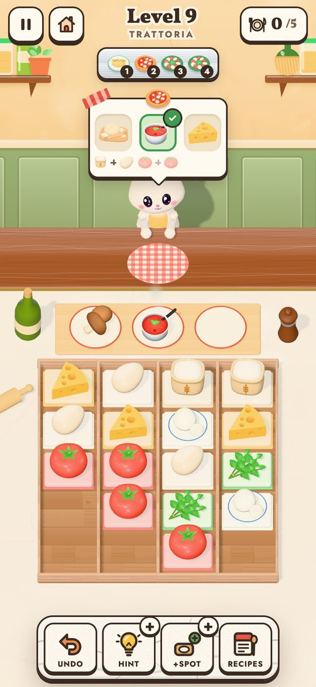
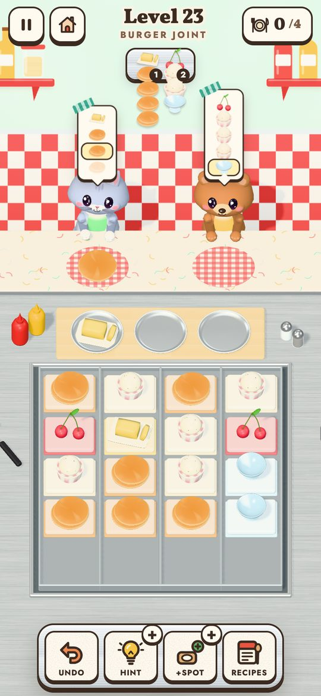
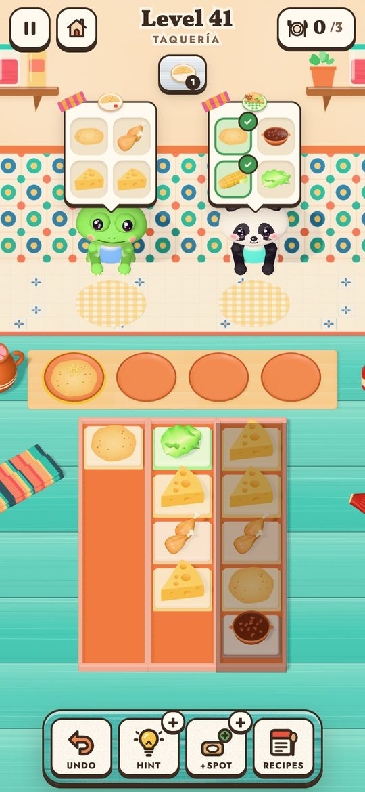
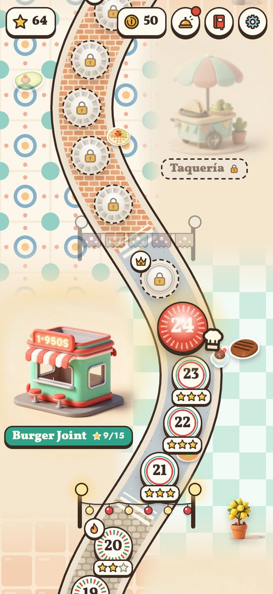

# 🍅 Mise en Place

A cozy 3D kitchen puzzle with no timers. Take ingredients from the pantry, let them combine on the
counter and serve every animal guest.

### ▶ [Play now](https://evgeny.io/games/mise-en-place/)

<p align="center">
  
  
  
  
</p>

```bash
npm install
npm run dev   # http://localhost:5180
npm test
```

How it works: [docs/development.md](docs/development.md).

<sub>Fonts: Vollkorn, Jost, Nunito (OFL 1.1). 3D: [three.js](https://threejs.org) (MIT). Paintings made
locally with [Z-Image Turbo](https://huggingface.co/Tongyi-MAI/Z-Image-Turbo) (Apache 2.0).</sub>
